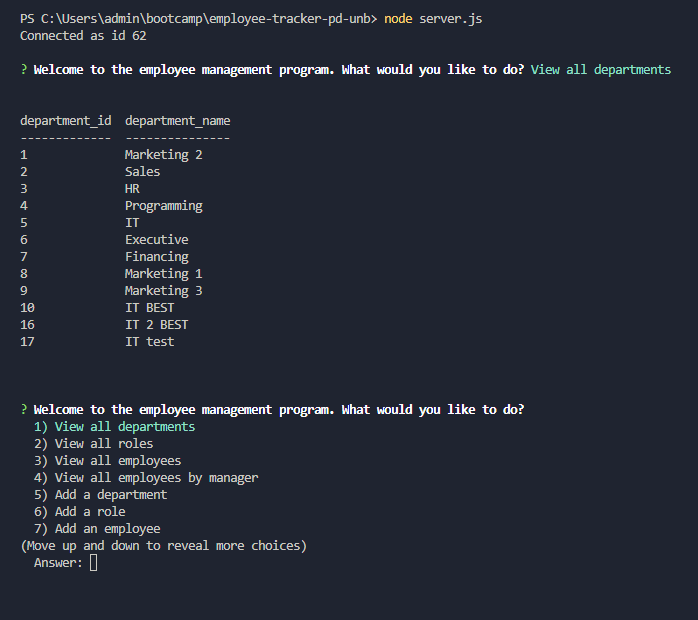

# employee-tracker-pd-unb
[](https://bootcamp.msu.edu/)


## Technologies


## Description
Developed a command-line application to manage a company's employee database. We used Node.js, Inquierer, and MySQL to developed the back end of the application. To begin the application, use must run: 
```
node index.js
```
## Installation
***Requirments***

[Node.js](https://nodejs.org/en/) | [Inquirer](https://www.npmjs.com/package/inquirer) | [MySQL](https://www.npmjs.com/package/mysql2)

***Once Installed:***
1. Clone the Repository on to your machine.
2. Open the terminal and ensure you are in the right file path.
3. Run the command ```npm install``` to download the packages.
4. Then run the command ```node server.js``` to run the software.
5. The command prompt will begin on your terminal

## User Story
```
AS A business owner
I WANT to be able to view and manage the departments, roles, and employees in my company
SO THAT I can organize and plan my business
```

## Acceptance Criteria
```
GIVEN a command-line application that accepts user input
WHEN I start the application
THEN I am presented with the following options: view all departments, view all roles, view all employees, add a department, add a role, add an employee, and update an employee role
WHEN I choose to view all departments
THEN I am presented with a formatted table showing department names and department ids
WHEN I choose to view all roles
THEN I am presented with the job title, role id, the department that role belongs to, and the salary for that role
WHEN I choose to view all employees
THEN I am presented with a formatted table showing employee data, including employee ids, first names, last names, job titles, departments, salaries, and managers that the employees report to
WHEN I choose to add a department
THEN I am prompted to enter the name of the department and that department is added to the database
WHEN I choose to add a role
THEN I am prompted to enter the name, salary, and department for the role and that role is added to the database
WHEN I choose to add an employee
THEN I am prompted to enter the employee’s first name, last name, role, and manager, and that employee is added to the database
WHEN I choose to update an employee role
THEN I am prompted to select an employee to update and their new role and this information is updated in the database
```

## Screenshot


## Video
A link to the [Video](https://watch.screencastify.com/v/EXYpiPwtsJuL0qZFOUGS):
```
https://watch.screencastify.com/v/EXYpiPwtsJuL0qZFOUGS
```

## Link
A link to the [code](https://github.com/Paul-Dimenshion/employee-tracker-pd-unb.git):
```
https://github.com/Paul-Dimenshion/employee-tracker-pd-unb.git
```

## License
  Copyright (c) Pavlo Demenshyn. All rights reserved.
  
  Licensed under the [MIT](LICENSE) license.